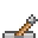

[![Contributors][contributors-shield]][contributors-url]
[![Forks][forks-shield]][forks-url]
[![Stargazers][stars-shield]][stars-url]
[![Issues][issues-shield]][issues-url]

# Shooter Game Pacific Treasures

This game was build using Phaser 3 to learn his functionalities

## Installation

- You can get a local copy of the repository please run the following commands on your terminal:
```
$ cd <folder>
$ git clone https://github.com/Rashad-Muntar/JS-Game.git
```
- Open your terminal and go for the folder you copied
- Run the command 'npm run-script start' and it will build and open the game at your browser


## Game Design Document

### Game Concept

On this game, you are Bob the octopus, and you are in a quest to find a treasure in the 16-bit layout deep sea. You need to face some sea creatures in order to achieve your goal, and you can kill the creatures by shooting ink from our hero and interact with levers on the scenario to open paths. You have a limited time to complete the quest.


### How to play

- To move our character you should use the left and right arrow keys on your keyboard.
- You can jump with the up arrow key, you can do one extra jump while on air performing a 'double jump'.
- To shoot an 'ink bullet' you should press the space key on your keyboard.

#### Interactive Scenario


- Our goal is to reach the chest, as soon as we got it we finish our quest. You get 250 points and the seconds you had left on the clock are then converted into points (Each second worth 5 points at the end).



- At some points, you will face a wall of seaweed. In order to open that wall, you need to activate the lever. You can do it by touching or shooting it.


## Built With
- Javascript
- HTML
- Phaser 3
- Webpack
- Jest
- Leaderboard API

## Testing

- Test made with Jest.

You can run test running npm test on console at the folder

## Design Credits

- The background used is from free assets on [itch io](https://ansimuz.itch.io/underwater-fantasy-pixel-art-environment)
- Most sea creatures are also from free assets you can find it [here](https://rapidpunches.itch.io/)
- The main character octopus is a twitch mascot from [hicelina](https://www.twitch.tv/hicelina) the original art creator is [Michael Perez](https://pixelfly.artstation.com/).

## Contributing

Contributions, issues and feature requests are welcome!

You can do it on [issues page](issues/).


## Show your support

Give a ⭐️ if you like this project!

## Author

👤 **Rashad Muntar**

- GitHub: [@Rashad-Muntar](https://github.com/Rashad-Muntar)
- Twitter - [@RashadToure](https://twitter.com/RashadToure)
- LinkedIn: [Rashad Muntar](https://www.linkedin.com/in/rashad-muntar/)

## License

This project is licensed under the MIT License